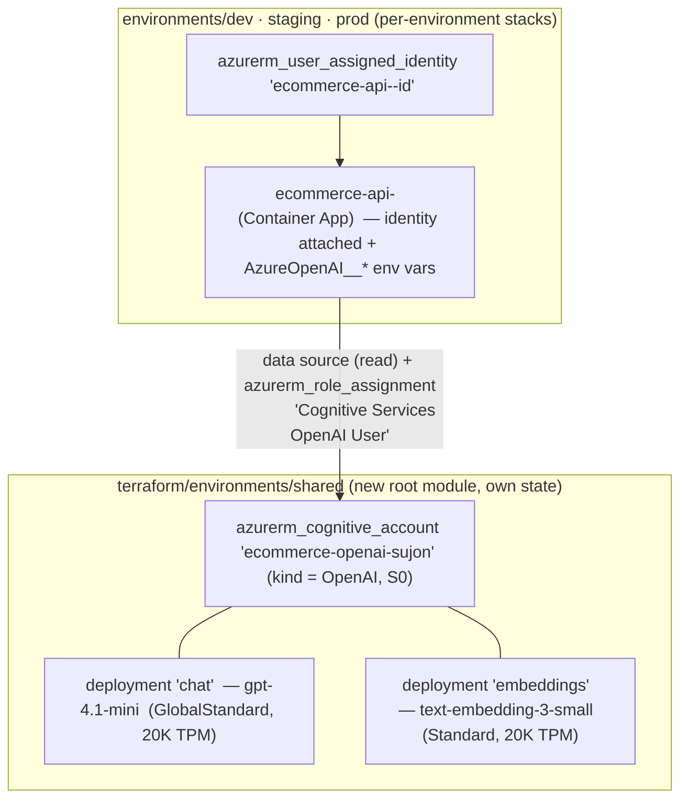

# Phase 1 — Infrastructure: Azure OpenAI + keyless access for the app

> **Goal:** stand up one Azure OpenAI account with a chat model and an embedding model, and give
> every environment's API container app permission to call it **without any API key** — using a
> managed identity and Azure RBAC. After this phase the plumbing exists; no application code uses
> it yet (that's Phase 3).

---

## 1. What we built



**One account, shared by all three environments.** This subscription's quota is
`OpenAI.S0.AccountCount = 1`, so a per‑environment OpenAI account is impossible. The account lives
in a new **`shared`** root module; the environments only *read* it and *grant their own app access*.

---

## 2. Concepts worth understanding

### 2.1 Account vs deployment
An **`azurerm_cognitive_account`** of `kind = "OpenAI"` is just the container/endpoint. It serves
nothing until you add **`azurerm_cognitive_deployment`** resources — one per model you want to
call. The app targets a deployment by **name** (`chat`, `embeddings`), not by model name, so you
can swap the underlying model later without touching app config.

### 2.2 Deployment "type": Standard vs GlobalStandard (and quota)
Every model+type pair has a separate **TPM (tokens‑per‑minute) quota**. We checked ours:

```
az cognitiveservices usage list -l eastus -o table
```

| Model | `Standard` (regional) | `GlobalStandard` |
|---|---|---|
| gpt-4o-mini | **0** | **0** |
| gpt-4.1-mini | **0** | **200K** ✅ |
| text-embedding-3-small | 350K ✅ | 1000K |

So the **chat deployment must be `GlobalStandard`** — regional `Standard` quota for every mini
chat model is zero on this subscription. `GlobalStandard` means Azure may serve the request from
any region worldwide (fine here; note it for data‑residency‑sensitive workloads). Embeddings are
fine on regional `Standard`.

In Terraform (azurerm 3.x) this is the **`scale` block**:
```hcl
scale {
  type     = "GlobalStandard"   # azurerm 4.x renames this block to `sku { name = ... }`
  capacity = 20                  # 20 = 20,000 TPM. Small on purpose — raise if you get HTTP 429s.
}
```

### 2.3 Control plane vs data plane (this trips everyone up)
- **Control plane** = "manage the resource" (create it, change its SKU, read its properties).
  Subscription **Owner / Contributor** covers this.
- **Data plane** = "use the resource" (call `/chat/completions`, `/embeddings`).
  Needs a **separate** role: **`Cognitive Services OpenAI User`**.

Being subscription Owner does **not** let you call the model. We saw exactly this:
```
401 PermissionDenied: The principal 'rabiul.islam@bjitgroup.com' lacks the required data action
'Microsoft.CognitiveServices/accounts/OpenAI/deployments/chat/completions/action'
```
Fix: assign `Cognitive Services OpenAI User` to whoever calls it — and **wait ~5 minutes**;
Cognitive Services data‑plane role assignments propagate slowly.

### 2.4 Managed identity + `DefaultAzureCredential`
Instead of an API key, the app gets an **Entra ID identity** and is granted the data‑plane role.
At runtime the Azure SDK's `DefaultAzureCredential` automatically fetches a token for that
identity — no secret in config, nothing to rotate.

Two kinds:
| | System‑assigned | User‑assigned (what we used) |
|---|---|---|
| Lifecycle | tied to the app; dies with it | standalone resource |
| `principal_id` known… | only *after* the app is created/updated | as soon as the identity resource is created |
| Terraform ordering | role assignment referencing it in the **same apply** fails (`principal_id ... no definition was found`) | works in one apply — identity is created first |
| `DefaultAzureCredential` | picked up automatically | must tell it which one via `AZURE_CLIENT_ID` |

We hit the system‑assigned ordering problem head‑on, so the module now creates an
**`azurerm_user_assigned_identity`** first, attaches it, and the app also gets an
`AZURE_CLIENT_ID` env var so `DefaultAzureCredential` selects it.

### 2.5 Custom subdomain & content filter
- `custom_subdomain_name` is **required** for Entra ID token auth (and gives the clean
  `https://<name>.openai.azure.com/` endpoint). We set it to the account name.
- Azure auto‑attaches a default content‑filter policy (`Microsoft.DefaultV2`). Terraform kept
  wanting to remove it (perpetual diff), so we **pin `rai_policy_name = "Microsoft.DefaultV2"`** —
  which also documents that content filtering is deliberately on.

---

## 3. Implementation

### 3.1 New module — `terraform/modules/openai/`

| File | Contents |
|---|---|
| `main.tf` | `azurerm_cognitive_account` (kind OpenAI, S0, custom subdomain) + two `azurerm_cognitive_deployment` (chat, embeddings), each with `scale` and pinned `rai_policy_name` / `version_upgrade_option = "NoAutoUpgrade"` |
| `variables.tf` | model names/versions, `*_scale_type`, `*_capacity`, `local_auth_enabled`, `rai_policy_name`, `tags` — all with sensible defaults |
| `outputs.tf` | `endpoint`, `account_id`, `account_name`, `chat_deployment_name`, `embedding_deployment_name` |

Key lines:
```hcl
resource "azurerm_cognitive_account" "this" {
  kind                  = "OpenAI"
  sku_name              = "S0"
  custom_subdomain_name = var.name
  local_auth_enabled    = var.local_auth_enabled   # true for now; flip to false in Phase 7
}

resource "azurerm_cognitive_deployment" "chat" {
  cognitive_account_id   = azurerm_cognitive_account.this.id
  version_upgrade_option = "NoAutoUpgrade"          # pin the model version; bump deliberately
  rai_policy_name        = var.rai_policy_name      # Microsoft.DefaultV2
  model  { format = "OpenAI"  name = "gpt-4.1-mini"  version = "2025-04-14" }
  scale  { type = "GlobalStandard"  capacity = 20 }
}
```

### 3.2 New root stack — `terraform/environments/shared/`

A **fourth** root module alongside dev/staging/prod, with its **own state**:

```hcl
# backend.tf
backend "azurerm" {
  resource_group_name  = "ecommerce-tfstate-rg"
  storage_account_name = "ecommercetfstateshared"   # created once, by hand (see §4)
  container_name       = "tfstate"
  key                  = "shared.terraform.tfstate"
}
```

```hcl
# main.tf
data "azurerm_resource_group" "shared" { name = var.resource_group_name }

module "openai" {
  source              = "../../modules/openai"
  name                = var.openai_account_name   # "ecommerce-openai-sujon"
  resource_group_name = data.azurerm_resource_group.shared.name
  location            = var.location              # "eastus"
}
```

It's applied **once, by a human** (rarely changes) — like the state‑storage bootstrap step.

### 3.3 `modules/container-app` — optional managed identity

```hcl
variable "assign_identity" { type = bool  default = false }
variable "location"        { type = string default = null }   # only needed when assign_identity

resource "azurerm_user_assigned_identity" "this" {
  count               = var.assign_identity ? 1 : 0
  name                = "${var.name}-id"
  resource_group_name = var.resource_group_name
  location            = var.location
}

resource "azurerm_container_app" "this" {
  # ...
  dynamic "identity" {
    for_each = var.assign_identity ? [1] : []
    content {
      type         = "UserAssigned"
      identity_ids = [azurerm_user_assigned_identity.this[0].id]
    }
  }
}

output "principal_id"       { value = one(azurerm_user_assigned_identity.this[*].principal_id) }
output "identity_client_id" { value = one(azurerm_user_assigned_identity.this[*].client_id) }
```

### 3.4 Each environment — `environments/{dev,staging,prod}/main.tf`

```hcl
# read the shared account (never create/modify it here)
data "azurerm_cognitive_account" "openai" {
  name                = var.openai_account_name
  resource_group_name = data.azurerm_resource_group.shared.name
}

module "api_app" {
  # ...
  assign_identity = true
  location        = data.azurerm_resource_group.shared.location

  env_vars = [
    # ...existing...
    { name = "AZURE_CLIENT_ID",                  value = module.api_app.identity_client_id },
    { name = "AzureOpenAI__Endpoint",            value = data.azurerm_cognitive_account.openai.endpoint },
    { name = "AzureOpenAI__ChatDeployment",      value = var.openai_chat_deployment },      # "chat"
    { name = "AzureOpenAI__EmbeddingDeployment", value = var.openai_embedding_deployment }, # "embeddings"
  ]
}

# grant THIS environment's API identity data-plane access to the shared account
resource "azurerm_role_assignment" "api_openai" {
  scope                = data.azurerm_cognitive_account.openai.id
  role_definition_name = "Cognitive Services OpenAI User"
  principal_id         = module.api_app.principal_id
}
```

The web app is unchanged — it has no reason to call the model.

### 3.5 Pipeline permission

`azurerm_role_assignment` needs `Microsoft.Authorization/roleAssignments/write`, which
**Contributor does not include**. The pipeline service principal was granted
**`Role Based Access Control Administrator`** scoped to the OpenAI account only, so CI can manage
these grants on future runs.

---

## 4. How to run it

```powershell
# --- one-time: state storage for the shared stack ---
az storage account create -n ecommercetfstateshared -g ecommerce-tfstate-rg -l eastus --sku Standard_LRS
az storage container create -n tfstate --account-name ecommercetfstateshared

# --- the shared stack (once) ---
cd terraform/environments/shared
terraform init
terraform apply                       # no secrets — the account uses Entra ID
terraform output                      # openai_endpoint, chat_deployment_name, ...

# --- each environment (adds identity + role + env vars to the API app) ---
cd ../dev                             # then ../staging, ../prod
$env:TF_VAR_postgres_admin_password = "<db password>"
$env:TF_VAR_jwt_key                 = "<this env's JWT key>"
terraform apply
```

The pipeline does the per‑environment part automatically now; the `shared` stack is manual.

---

## 5. What exists now (outputs)

**Account:** `ecommerce-openai-sujon` — endpoint **`https://ecommerce-openai-sujon.openai.azure.com/`**

| Deployment | Model | Type | Capacity |
|---|---|---|---|
| `chat` | gpt-4.1-mini (2025-04-14) | GlobalStandard | 20K TPM |
| `embeddings` | text-embedding-3-small (v1) | Standard | 20K TPM |

**Per environment:**
- User‑assigned identity `ecommerce-api-<env>-id`, attached to `ecommerce-api-<env>`
- Role assignment: that identity → `Cognitive Services OpenAI User` on the account
- Env vars on the API app: `AZURE_CLIENT_ID`, `AzureOpenAI__Endpoint`,
  `AzureOpenAI__ChatDeployment=chat`, `AzureOpenAI__EmbeddingDeployment=embeddings`

**Also granted:** `rabiul.islam@bjitgroup.com` → `Cognitive Services OpenAI User` (so you can call
the model locally with `az login`), and the pipeline SP → `Role Based Access Control Administrator`
on the account.

**State:** `ecommercetfstateshared` storage account, blob `shared.terraform.tfstate`
(blob versioning enabled).

---

## 6. Verification

```powershell
# deployments healthy
az cognitiveservices account deployment list -n ecommerce-openai-sujon -g ecommerce-rg -o table
#   chat        gpt-4.1-mini            GlobalStandard  Succeeded
#   embeddings  text-embedding-3-small  Standard        Succeeded

# who can call the model
az role assignment list --scope "$(az cognitiveservices account show -n ecommerce-openai-sujon -g ecommerce-rg --query id -o tsv)" `
  --query "[].{who:principalType, role:roleDefinitionName}" -o table
#   3x ServicePrincipal  Cognitive Services OpenAI User   <- the 3 api identities
#   1x User              Cognitive Services OpenAI User   <- you

# an API app has the identity + config
az containerapp show -n ecommerce-api-dev -g ecommerce-rg --query "identity" -o json
az containerapp show -n ecommerce-api-dev -g ecommerce-rg `
  --query "properties.template.containers[0].env[?starts_with(name,'AzureOpenAI') || name=='AZURE_CLIENT_ID']" -o table

# smoke test the endpoint yourself (after ~5 min for the role to propagate)
$tok  = az account get-access-token --resource https://cognitiveservices.azure.com --query accessToken -o tsv
Invoke-RestMethod -Method Post -ContentType 'application/json' -Headers @{Authorization="Bearer $tok"} `
  -Uri "https://ecommerce-openai-sujon.openai.azure.com/openai/deployments/chat/chat/completions?api-version=2024-10-21" `
  -Body '{"messages":[{"role":"user","content":"say OK"}],"max_tokens":5}'
#   -> choices[0].message.content = "OK"

# steady state
terraform plan   # -> "No changes." in shared, dev, staging, prod
```

---

## 7. Gotchas we actually hit (the useful part)

| # | Symptom | Cause | Fix |
|---|---|---|---|
| 1 | `Blocks of type "sku" are not expected here` / `At least 1 "scale" blocks are required` | azurerm **3.x** uses `scale { type, capacity }`; `sku { name, capacity }` is a 4.0 change | use `scale` |
| 2 | Deployment create fails with a 0‑quota error | regional `Standard` quota for gpt‑4.1‑mini is 0 on this subscription | chat deployment `scale.type = "GlobalStandard"` |
| 3 | `401 PermissionDenied` calling the model as subscription Owner | data‑plane ≠ control‑plane | assign `Cognitive Services OpenAI User`; wait ~5 min |
| 4 | Chat 401 kept failing for minutes while embeddings worked | Cognitive Services data‑plane RBAC propagation is slow and uneven | just wait — retried and it went green |
| 5 | `terraform plan` never settles: wants to null `rai_policy_name` every run | Azure auto‑attaches `Microsoft.DefaultV2`; config didn't set it | pin `rai_policy_name = "Microsoft.DefaultV2"` |
| 6 | `azurerm_role_assignment ... principal_id ... no definition was found` | system‑assigned identity's `principal_id` is null at plan time when the identity is added in the same apply | switch to a **user‑assigned** identity (created first) |
| 7 | `azurerm_role_assignment` silently absent from the plan / pipeline can't create it | `Contributor` lacks `Microsoft.Authorization/roleAssignments/write` | grant the pipeline SP `Role Based Access Control Administrator` on the account |
| 8 | Local `terraform apply` wants to roll a container image backward | pipeline deployed a newer build between applies; `image_tag` is pinned in `terraform.tfvars` | bump `image_tag` to the live build (dev/staging = 45, prod = 44), or pass `-var image_tag=<n>` |

---

## 8. Cost

The account and deployments cost **nothing at rest** — Azure OpenAI is pay‑per‑token. At 20K TPM
caps and learning‑level traffic this stays around a few dollars a month once Phases 4–6 are using
it. `text-embedding-3-small` is ~1/60th the cost of the chat model per token.

---

## 9. Next

- **Phase 2 — pgvector:** enable the `vector` extension on `ecommerce-postgres-sujon` (a
  server‑parameter change + a restart, done once with `az` since the server is a read‑only shared
  resource in Terraform), then `CREATE EXTENSION vector` per database via an EF migration.
- **Phase 3 — .NET wiring:** add `Microsoft.Extensions.AI` + `Azure.AI.OpenAI`, register
  `IChatClient` and `IEmbeddingGenerator` in `Program.cs` using
  `new AzureOpenAIClient(new Uri(cfg["AzureOpenAI:Endpoint"]), new DefaultAzureCredential())`.
  Locally, `az login` satisfies the credential; in the container, the user‑assigned identity does.

---

## 10. File map for this phase

```
terraform/
├── modules/
│   ├── openai/                       # NEW — account + chat/embedding deployments
│   │   ├── main.tf
│   │   ├── variables.tf
│   │   └── outputs.tf
│   └── container-app/
│       ├── main.tf                   # + azurerm_user_assigned_identity, UserAssigned identity block
│       ├── variables.tf              # + assign_identity, location
│       └── outputs.tf                # + principal_id, identity_client_id
└── environments/
    ├── shared/                       # NEW root stack (own state)
    │   ├── backend.tf  main.tf  variables.tf  terraform.tfvars  outputs.tf
    ├── dev/    main.tf + variables.tf   # + openai data source, role assignment, 4 env vars
    ├── staging/ …  (same)
    └── prod/    …  (same)
```
