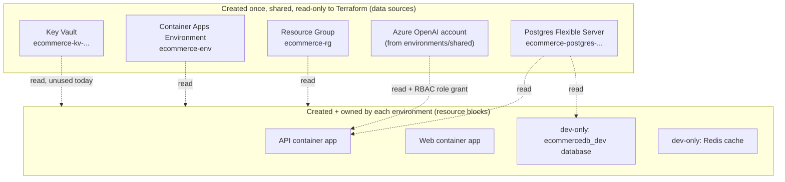

# Terraform Learning Guide — "I forgot everything, re-explain it to me"

This is a **teaching document**, not a reference spec (that already exists at
[terraform/README.md](../../terraform/README.md) — read it *after* this one, it explains the
*why* behind every decision). This file exists so that after weeks away from the project you can
re-read it top to bottom and regain the full mental model: what Terraform is, what every file in
[terraform/](../../terraform/) does, and how they all connect.

---

## 1. What Terraform actually is (30-second refresher)

Terraform is a tool that turns `.tf` files (text, in plain English-like syntax called **HCL**)
into real cloud resources (in this project: Azure resource groups, container apps, databases...).
You describe **what you want to exist**, and Terraform figures out **how to get there** from
whatever currently exists.

Four commands, used in this order, forever:

```powershell
terraform init      # 1. download the Azure provider plugin + connect to remote "state" storage
terraform plan      # 2. compare your .tf files vs. the last-known state vs. real Azure -> print a diff, change nothing
terraform apply     # 3. actually perform that diff (asks "yes" first), then save the new state
terraform destroy   # 4. delete everything Terraform created in this folder (only this folder's stuff)
```

Nothing is applied by just editing a `.tf` file — `apply` is the only command that changes Azure.
`plan` is always safe to run (read-only).

---

## 2. The vocabulary (every keyword you'll see in a `.tf` file)

| Keyword | What it means | Example in this repo |
|---|---|---|
| `provider` | Which cloud/API Terraform talks to, and how it authenticates | `provider "azurerm" {}` — the Azure provider |
| `resource "TYPE" "NAME" { ... }` | "Create and manage this thing." Terraform creates it, and will update/destroy it if you change/remove this block | `resource "azurerm_container_app" "this" { ... }` |
| `data "TYPE" "NAME" { ... }` | "Go **read** this thing that already exists — never create, never touch it." Read-only lookup | `data "azurerm_resource_group" "shared" { name = "ecommerce-rg" }` |
| `variable "NAME" { ... }` | An input — a value the caller supplies. Like a function parameter | `variable "image_tag" { type = string }` |
| `output "NAME" { value = ... }` | A value Terraform prints after `apply`, or hands to a parent module | `output "api_url" { value = "https://..." }` |
| `module "NAME" { source = "..." , ... }` | "Reuse this folder of `.tf` files as a template, with these inputs." Think: calling a function | `module "api_app" { source = "../../modules/container-app" ... }` |
| `locals { NAME = ... }` | A named expression computed once, reused elsewhere in the same file (not an input, not an output — just a local variable) | `locals { api_fqdn = "${local.api_app_name}.${...}" }` |
| **State** (`.tfstate`) | Terraform's memory: "here is exactly what I created last time and its current settings." Stored remotely (Azure Storage), never in git | configured by each environment's `backend.tf` |
| **Backend** | Where the state file physically lives | `backend "azurerm" { storage_account_name = "ecommercetfstatedev" ... }` |
| **Root module** | Any folder you directly run `terraform init/plan/apply` in | each folder under `terraform/environments/` |
| **Child module** | A reusable folder referenced via `module { source = ... }` — never applied directly | each folder under `terraform/modules/` |

**The single most important mental distinction in this repo:** `resource` = "Terraform owns it,
can destroy it." `data` = "Terraform only looks at it, can never destroy it." Nearly every design
decision below exists to keep the shared Azure resources as `data` (safe) and only the
per-environment app resources as `resource` (owned).

---

## 3. Why this repo's Terraform looks the way it does (the one constraint that explains everything)

The Azure subscription used here is a **restricted/sponsored** subscription with hard quotas:

- Only **one Container Apps Environment per region** is allowed.
- No spare quota for a **second PostgreSQL Flexible Server**.
- Only **one Azure OpenAI account** is allowed.

Those platform pieces (resource group, Container Apps Environment, Postgres server, Key Vault)
were already created once, manually/by the CI pipeline (`azure-pipelines.yml`). Terraform is not
allowed to (and cannot, quota-wise) create second copies — so it only **reads** them via `data`
blocks, and **creates/owns** just the small, per-environment pieces: the container apps, and (for
dev only) a dedicated database.



---

## 4. Folder-by-folder map

```
terraform/
├── global/              Reference-only copy/paste source (NOT auto-shared — see §6)
├── modules/             Reusable templates — never applied directly
│   ├── container-app/   ACTIVELY USED (api + web apps in every environment)
│   ├── openai/          ACTIVELY USED (only by environments/shared)
│   ├── resource-group/  Built but unused today (kept for a less-restricted subscription later)
│   ├── key-vault/       Built but unused today
│   ├── postgresql/      Built but unused today (creates a NEW server; this subscription can't have a 2nd)
│   └── container-app-env/  Built but unused today (creates a NEW Container Apps Environment)
└── environments/        Each folder = one deployable stack, own state file
    ├── shared/          Azure OpenAI account (applied once, used by all envs)
    ├── dev/             Dev container apps + dev's own database + Redis
    ├── staging/         Staging container apps (shared ecommercedb)
    ├── prod/            Prod container apps (shared ecommercedb)
    └── aks-learning/    Unrelated throwaway AKS cluster for a Kubernetes learning exercise
```

**Rule of thumb:** if a folder has a `backend.tf`, it's an **environment** (a root module you
`cd` into and run commands in). If it only has `main.tf` / `variables.tf` / `outputs.tf` with no
`backend.tf`, it's a **module** (a template something else calls).

---

## 5. `modules/` — the reusable templates

### 5.1 `modules/container-app/` (the one that matters most — used 6 times: api+web × dev/staging/prod)

Creates **one Azure Container App**. Called once per app, per environment, with different inputs.

| File | Contents |
|---|---|
| `main.tf` | `azurerm_user_assigned_identity` (optional, only if `assign_identity = true`) + the `azurerm_container_app` resource itself: ingress, `secret` blocks, `registry` block (optional), the container's `env` vars, and optional HTTP `startup_probe` / `liveness_probe` / `readiness_probe` |
| `variables.tf` | Every input the caller can set: `name`, `image`, `cpu`, `memory`, `min/max_replicas`, `env_vars`, `secrets`, `health_probe_path`, `assign_identity`, `registry_*`, etc. |
| `outputs.tf` | `id`, `name`, `fqdn`, `latest_revision_name`, `principal_id` (the managed identity's object ID — used to grant RBAC roles), `identity_client_id` (fed into `AZURE_CLIENT_ID` so the app's code knows which identity to authenticate as) |

Key details worth remembering:
- **`assign_identity = true`** creates a *user-assigned managed identity* — this is how the API
  calls Azure OpenAI without any API key: Azure grants the identity an RBAC role instead.
- **`health_probe_path`** is only set for the API (`/health`). The Web app passes `null`, so it
  gets Container Apps' default plain TCP check instead of HTTP probes.
- **`lifecycle.ignore_changes`** on `workload_profile_name` and `revision_suffix` — these are
  provider quirks/manual-only fields; see the comment in the file for the full reasoning. The
  container **image** is deliberately *not* ignored — Terraform is the thing that rolls new
  image deploys (via `-var image_tag=...`), not the old `az containerapp update` scripts.

### 5.2 `modules/openai/` (used once, by `environments/shared`)

Creates **one Azure OpenAI Cognitive Services account** + two **model deployments**:

- `azurerm_cognitive_account` (kind `"OpenAI"`, SKU `S0`) — the account itself.
- `azurerm_cognitive_deployment.chat` — e.g. `gpt-4.1-mini`, scale type `GlobalStandard` (this
  subscription has 0 regional "Standard" quota for mini models, so it must be Global).
- `azurerm_cognitive_deployment.embeddings` — e.g. `text-embedding-3-small`.

### 5.3 The four unused-today modules (`resource-group`, `key-vault`, `postgresql`, `container-app-env`)

These were written first, for a fully-isolated-per-environment design (every environment gets its
*own* resource group / vault / Postgres server / Container Apps Environment) — the textbook
Terraform pattern. The subscription's quotas made that impossible, so **no environment calls them
today**. They're kept because:
1. They still `terraform validate` cleanly — free reference examples.
2. A future less-restricted subscription could reuse them unchanged.

Don't be confused if you read one and then can't find where it's `module`-called from an
environment — it genuinely isn't called anywhere right now.

---

## 6. `global/` — copy-paste source, NOT auto-included

`global/providers.tf` and `global/variables.tf` are **not referenced by any environment**.
Terraform has no mechanism for one root module to "import" another root module's provider/variable
blocks. These files exist purely so that when you bump the azurerm provider version, you have one
place to copy the new block from into each environment's own `main.tf`, keeping them consistent.
(Real cross-environment sharing without copy/paste would need a separate tool like Terragrunt —
intentionally not used here, to keep things simpler while learning.)

---

## 7. `environments/` — the stacks you actually `apply`

Every environment folder has the same five files (except `aks-learning`, which skips remote state):

| File | Purpose |
|---|---|
| `backend.tf` | Where this environment's **state file** lives (an Azure Storage container). Each environment has its own storage account + state key — so dev/staging/prod can never see or destroy each other's resources. |
| `main.tf` | The actual `data` sources (what's read-only) + `resource`/`module` blocks (what's created) + `locals` (computed values) for this environment. |
| `variables.tf` | Declares every input this environment accepts, with types, descriptions, and defaults where safe. Sensitive ones (`postgres_admin_password`, `jwt_key`) have **no default** and `sensitive = true` — Terraform refuses to proceed until you supply them. |
| `terraform.tfvars` | The actual **non-secret** values for this environment (committed to git) — resource names, SKU sizes, replica counts, `image_tag`. |
| `outputs.tf` | What this environment prints after `apply` — URLs, FQDNs, database name. |

### 7.1 `environments/dev/` — the most complete example, read this one first

Walking through its `main.tf` top to bottom:

1. `terraform { required_version, required_providers }` + `provider "azurerm" {}` — same block
   copy-pasted from `global/providers.tf`.
2. Four `data` blocks read the shared resource group, Container Apps Environment, Postgres
   server, and Key Vault (all pre-existing, never modified).
3. A fifth `data "azurerm_cognitive_account" "openai"` reads the OpenAI account created by
   `environments/shared`.
4. `locals` computes tag sets and the **predictable FQDNs** (`<app-name>.<env-domain>`) for both
   apps — this sidesteps a circular-dependency problem (see §8).
5. `resource "azurerm_postgresql_flexible_server_database" "this"` — **dev creates its own
   database** (`ecommercedb_dev`) on the shared server. Staging/prod don't have this resource —
   they just reference the pre-existing shared `ecommercedb` by name.
6. `resource "azurerm_redis_cache" "this"` — dev also provisions a small Redis cache
   (Basic/C0) for caching, wired into the API via a secret.
7. `module "api_app"` — calls `modules/container-app` with `assign_identity = true`, passes
   `secrets` (Postgres connection string, JWT key, Redis connection string) and `env_vars`
   (including Azure OpenAI endpoint/deployment names and `AZURE_CLIENT_ID`).
8. `resource "azurerm_role_assignment" "api_openai"` — grants the API's managed identity the
   **"Cognitive Services OpenAI User"** role on the OpenAI account (data-plane access to call
   chat/embeddings — being subscription Owner is *not* enough for this).
9. `module "web_app"` — simpler: no identity, no secrets, just points `ApiBaseUrl` at the API.

Staging and prod are structurally almost identical, minus the `azurerm_postgresql_flexible_server_database`
resource and the Redis cache (not present there) — just bigger `terraform.tfvars` numbers
(CPU/memory/replicas) and `postgres_database_name = "ecommercedb"` (the pre-existing shared DB).

### 7.2 `environments/shared/`

A **separate, fourth stack** with its own state (because this subscription allows only *one*
Azure OpenAI account total, so it can't be duplicated per-environment). Calls `modules/openai`
once. `dev`/`staging`/`prod` read its output via a `data "azurerm_cognitive_account"` lookup by
name — they don't reference its Terraform state directly (there's no cross-state reference
mechanism wired up here; it's done by name instead, which is simpler to reason about).

### 7.3 `environments/aks-learning/`

Unrelated to the dev/staging/prod/shared web-app stack. A **throwaway, single-node AKS cluster**
used for the [Kubernetes learning exercises](../kubernetes-learning/README.md) — apply it, learn,
`terraform destroy` it when done. Notice it creates its *own* `azurerm_resource_group` (unlike the
other environments, which only read the shared one) because it's an isolated side-project, not
part of the shared-platform constraint.

---

## 8. The circular-dependency trick (API ↔ Web URLs)

The API's CORS setting needs the Web app's URL; the Web app's `ApiBaseUrl` needs the API's URL.
Referencing each other's Terraform output directly would create a dependency cycle Terraform
can't resolve. The fix used here: Container Apps FQDNs are **predictable** —
`<app-name>.<environment-default-domain>` — so both URLs are computed in `locals` from the
*environment's* domain, and neither `module` block depends on the other:

```hcl
locals {
  api_fqdn = "${local.api_app_name}.${data.azurerm_container_app_environment.shared.default_domain}"
  web_fqdn = "${local.web_app_name}.${data.azurerm_container_app_environment.shared.default_domain}"
}
```

---

## 9. Where secrets actually live

| Secret | Lives in | Never in |
|---|---|---|
| `postgres_admin_password`, `jwt_key` | Your shell's `$env:TF_VAR_...` for the session, or a secret CI pipeline variable | `terraform.tfvars` (git-committed) |
| The resulting Postgres connection string / JWT key at runtime | `azurerm_container_app` `secret` blocks — the container reads them via `secretref:` | Plain env vars, logs |
| Terraform state (may contain resolved secret values) | The `backend.tf` Azure Storage account | Local disk, git (`.gitignore` blocks `*.tfstate` everywhere) |

Before running `apply` locally you must set both:
```powershell
$env:TF_VAR_postgres_admin_password = "<password>"
$env:TF_VAR_jwt_key                 = "<jwt signing key>"
```

---

## 10. The commands you'll actually type (cheat sheet)

Always run these **from inside one environment folder**, e.g. `terraform/environments/dev/`:

```powershell
terraform fmt -recursive     # auto-format all .tf files in this folder tree
terraform validate           # syntax/type-check only — no Azure calls, no credentials needed
terraform init                # first time, or after changing backend.tf / adding a provider
terraform plan                # preview — READ the diff before applying
terraform apply                # make the changes (asks to confirm)
terraform output               # show this environment's URLs/FQDNs
terraform state list           # list everything Terraform currently manages here
terraform destroy              # tear down only this environment's resources
```

**Healthy steady state:** `terraform plan` in dev/staging/prod says `No changes` — and the four
shared resources (resource group, Container Apps Environment, Postgres server, Key Vault) should
*never* show as "will be created/destroyed", only ever as data reads. If you ever see those as
`+ create` or `- destroy` in a plan, stop and re-read §3 — something's wrong (likely a renamed
`data` source name no longer matching the real Azure resource name).

---

## 11. Quick "I'm back after a long break" checklist

1. Re-read §3 (the one constraint) and §7.1 (dev's `main.tf` walkthrough) — that's 90% of the
   mental model.
2. `cd terraform/environments/dev`
3. Set the two secret env vars (§9) — ask whoever last ran this / check the `ecommerce-secrets`
   pipeline variable group for the current values.
4. `terraform init` then `terraform plan` — if it says `No changes`, the deployed infra already
   matches the code and you're safe to start making edits.
5. Make your change in `main.tf` / `variables.tf` / `terraform.tfvars`, run `terraform plan`
   again, read the diff carefully, then `terraform apply`.
6. For the deeper "why" behind every design choice (the import-on-staging/prod story, the
   pipeline integration, next steps not yet done), read
   [terraform/README.md](../../terraform/README.md) in full — it's longer but authoritative.

## 12. Related docs in this repo

- [terraform/README.md](../../terraform/README.md) — the full architecture reference ("why" for
  every decision mentioned here).
- [docs/rebuild-from-scratch/02-terraform.md](../rebuild-from-scratch/02-terraform.md) — a
  step-by-step runbook if you ever need to rebuild this infrastructure from zero on a fresh Azure
  subscription.
- [docs/kubernetes-learning/](../kubernetes-learning/) — the learning track that
  `environments/aks-learning/` supports.
