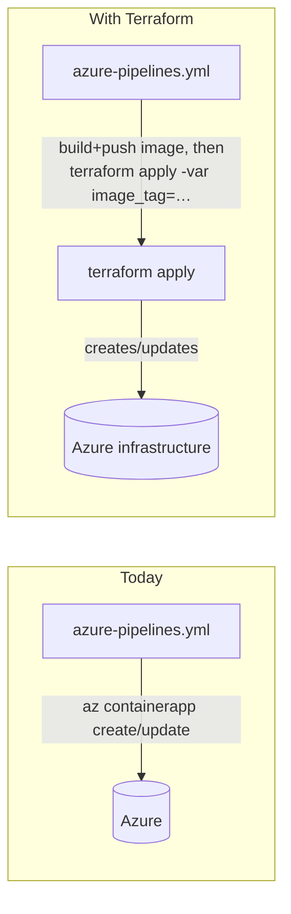
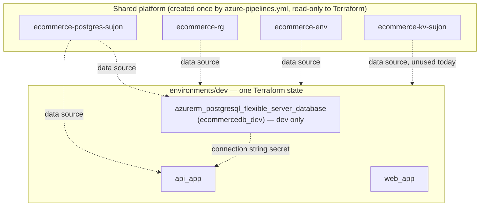
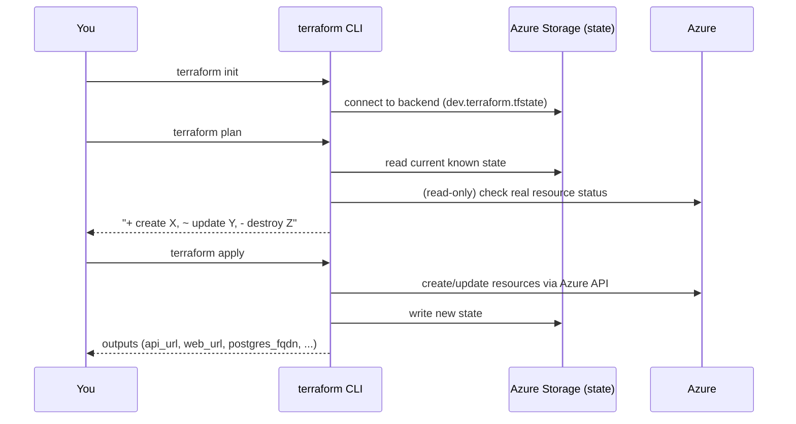

# Terraform Guide — ECommerceProject Infrastructure

This document explains **what** was added under [terraform/](.), **why** it's structured this way,
and **how** the whole thing actually runs end-to-end — so you can read it once and understand the
full flow without having to reverse-engineer the `.tf` files.

---

## 1. The big picture

Today, your infrastructure is created **imperatively** by [azure-pipelines.yml](../azure-pipelines.yml)
using `az containerapp create/update` shell commands during every pipeline run. That works, but it
has downsides:

- No single source of truth for "what infrastructure should exist" — it's implicit in a script.
- No `terraform plan` — you can't preview what a change will do before it happens.
- No easy way to see drift (someone changes a setting in the Azure Portal, nothing notices).

**Subscription constraint that shapes everything below:** this is a restricted/sponsored Azure
subscription with hard quotas — max **one Container Apps Environment per region**, and no spare
capacity to create a second PostgreSQL Flexible Server. Both already exist, created by
`azure-pipelines.yml` (`ecommerce-rg` / `ecommerce-env` / `ecommerce-postgres-sujon` /
`ecommerce-kv-sujon`). So Terraform treats the resource group, Container Apps Environment,
PostgreSQL server, and Key Vault as **read-only shared platform resources** (via `data` blocks) —
it never creates, modifies, or destroys them — and only manages what genuinely differs per
environment: each environment's two container apps. `dev` also creates one dedicated database
(`ecommercedb_dev`) on the shared server; `staging` and `prod` connect to the existing shared
`ecommercedb`.

Terraform replaces the **"create/configure infrastructure"** part with declarative code. The
**application deployment** part (build image → push → point the Container App at the new image
tag) can stay in the pipeline, or be folded into Terraform later — see [§8](#8-how-this-relates-to-azure-pipelinesyml-today).



---

## 2. Folder structure

```
terraform/
├── modules/                    # Reusable, environment-agnostic building blocks
│   ├── resource-group/         # azurerm_resource_group (kept for reference; not called by any environment today)
│   ├── key-vault/               # azurerm_key_vault, RBAC-based (kept for reference; not called today)
│   ├── postgresql/              # azurerm_postgresql_flexible_server + database + firewall rules (kept for reference; not called today — see note below)
│   ├── container-app-env/      # Log Analytics workspace + azurerm_container_app_environment (kept for reference; not called today)
│   ├── container-app/          # azurerm_container_app (used once for "api", once for "web") — ACTIVELY USED
│   │                           #   ingress, secrets, env vars, and optional HTTP startup/liveness/
│   │                           #   readiness probes (set health_probe_path; the API uses "/health")
│   └── openai/                 # azurerm_cognitive_account (kind OpenAI) + chat & embedding deployments
│                               #   — used only by environments/shared
├── environments/
│   ├── shared/                 # Singletons every env consumes — currently just the one Azure OpenAI
│   │                           #   account (quota = 1). Own state (shared.terraform.tfstate). Apply once.
│   ├── dev/                    # Deployable stack for Development
│   ├── staging/                # Deployable stack for Staging
│   └── prod/                   # Deployable stack for Production
├── global/                     # Reference-only files (see §6)
└── .gitignore                  # Keeps state/secrets out of git
```

> **Why keep unused modules around?** They were built first for a fully-isolated-per-environment
> design, before the subscription's quotas were discovered. They're valid, tested (`terraform
> validate` passes), and would become useful again on a less-restricted subscription — but no
> environment calls them today. The `postgresql` module specifically creates a **new server**,
> which this subscription can't provision a second of, so each environment instead declares a
> standalone `azurerm_postgresql_flexible_server_database` resource directly in its own `main.tf`,
> pointing at the *existing* shared server via a `data` source.

**Key idea:** a *module* is not deployable by itself — it's a template. An *environment* folder is
what you actually `terraform apply`. Each environment:

1. Declares the Azure provider + required Terraform version.
2. Reads the shared platform resources (resource group, Container Apps Environment, PostgreSQL
   server, Key Vault) as `data` sources — never creates/modifies/destroys them.
3. Creates its own two container apps. **dev** additionally creates its own `ecommercedb_dev`
   database on the shared server; **staging / prod** just connect to the existing shared
   `ecommercedb` (name referenced from a variable, not managed).
4. Has its own **state file** (its own memory of what *it* created) — dev, staging and prod
   state files are isolated from each other, so `terraform destroy` in dev only ever removes
   dev's two container apps + `ecommercedb_dev`, and `destroy` in staging/prod only their two
   container apps — never each other's, never the shared platform resources or `ecommercedb`
   (Terraform has no permission model that would let it destroy something it only ever read via
   `data`).



Staging and prod folders are structurally almost identical to dev — same `data` sources, same
pattern, different `terraform.tfvars` (bigger CPU/memory/replica counts for prod). The one
difference: they have **no** `azurerm_postgresql_flexible_server_database` resource — their
`postgres_database_name` is just `ecommercedb` (the existing shared DB) woven into the connection
string.

---

## 3. What each environment actually creates vs. reads

| Resource | How it's referenced | Notes |
|---|---|---|
| Resource group (`ecommerce-rg`) | `data "azurerm_resource_group" "shared"` | Read-only. Already exists. |
| Container Apps Environment (`ecommerce-env`) | `data "azurerm_container_app_environment" "shared"` | Read-only. Subscription allows only 1 per region, already consumed by this one. |
| PostgreSQL Flexible Server (`ecommerce-postgres-sujon`) | `data "azurerm_postgresql_flexible_server" "shared"` | Read-only. Firewall rules on it already allow Azure services + all IPs — no new firewall rule needed. |
| Key Vault (`ecommerce-kv-sujon`) | `data "azurerm_key_vault" "shared"` | Read-only. Not yet wired to the container apps at runtime (see [§9](#9-suggested-next-steps)). |
| Application database | see next column | **dev** creates its own `ecommercedb_dev` (`resource "azurerm_postgresql_flexible_server_database" "this"`) and auto-runs EF migrations into it on startup (the app only migrates in `Development`). **staging and prod** connect to the pre-existing shared **`ecommercedb`** — schema + data already live there — so Terraform only references the name from `var.postgres_database_name` and never creates or manages it. |
| API + Web container apps | `module "api_app"` / `module "web_app"` (the `container-app` module) | **Created** by Terraform — the only genuinely per-environment compute. |

The `resource-group`, `key-vault`, `postgresql`, and `container-app-env` **modules** under
`modules/` still exist and still `terraform validate` cleanly, but no environment calls them today
(see the note in [§2](#2-folder-structure)) — only the `container-app` module is actively used.

---

## 4. The full command flow

### One-time setup (per environment, done once by a human)
Terraform's remote state needs somewhere to live *before* `terraform init` can use it. This is the
one manual, imperative step:

```powershell
az group create -n ecommerce-tfstate-rg -l eastus
az storage account create -n ecommercetfstatedev -g ecommerce-tfstate-rg -l eastus --sku Standard_LRS
az storage container create -n tfstate --account-name ecommercetfstatedev
```
(Repeat with `ecommercetfstatestg` / `ecommercetfstateprod` for the other environments — see each
environment's `backend.tf`.)

> **Status:** all three state storage accounts + `tfstate` containers already exist, and **all
> three environments are applied** — dev, staging and prod each have their two container apps under
> Terraform and all three APIs report `/health` = `Healthy` against `ecommercedb`. The steps below
> are what was done and what to repeat for future changes.

### One-time setup for staging & prod: import the pre-existing container apps

`ecommerce-api-{staging,prod}` and `ecommerce-web-{staging,prod}` were created by the old
imperative `az containerapp create` pipeline, so they already exist in Azure. The azurerm provider
refuses to *create* over an existing resource — it has to be **imported** into Terraform state
first (a one-time migration of management, not a re-create). Dev didn't need this because its two
apps were already brought under Terraform. **This has already been done for staging and prod** —
it's recorded here for reference and in case a state file is ever rebuilt.

```powershell
cd terraform/environments/staging   # then repeat for prod, swapping "staging" -> "prod"

$env:TF_VAR_postgres_admin_password = "<ecommerce-postgres-sujon admin password>"
$env:TF_VAR_jwt_key                 = "<the JWT key this environment's API expects>"

terraform init

# NOTE the casing: the provider requires the literal segment "containerApps", not "containerapps"
# (which is what `az … --query id` prints).
terraform import module.api_app.azurerm_container_app.this `
  "/subscriptions/<sub-id>/resourceGroups/ecommerce-rg/providers/Microsoft.App/containerApps/ecommerce-api-staging"
terraform import module.web_app.azurerm_container_app.this `
  "/subscriptions/<sub-id>/resourceGroups/ecommerce-rg/providers/Microsoft.App/containerApps/ecommerce-web-staging"
```

The **first `terraform plan` after import shows changes to the two imported apps** — that's
expected: the old pipeline set no tags and didn't set `Jwt__Issuer` / `Jwt__Audience` /
`Jwt__ExpiryMinutes`, whereas Terraform adds the `environment` / `project` / `managed_by` tags and
those env vars, and rewrites the `postgres-connection` secret from `TF_VAR_postgres_admin_password`.
Applying that *is* the migration. `azure-pipelines.yml`'s deploy stages run these same
`terraform import` calls, guarded so they're a no-op once state is populated, so a rebuilt-state CI
run self-heals too.

> **A Terraform secret-only change does not roll a new Container App revision.** After an apply that
> only changed the `postgres-connection` / `jwt-key` value (e.g. a password rotation), force one so
> the running replicas pick it up:
> `az containerapp update -n ecommerce-api-<env> -g ecommerce-rg --revision-suffix r$(Get-Date -Format 'MMddHHmm')`
> A normal deploy (image tag change) rolls a revision on its own, so this only matters for manual
> credential changes. `revision_suffix` is in the module's `ignore_changes`, so this won't fight a
> later `terraform apply`.

### Every time you want to change an environment's infrastructure

```powershell
cd terraform/environments/dev      # or staging / prod

# Secrets are never in terraform.tfvars — export them for this shell session only:
$env:TF_VAR_postgres_admin_password = "<the-ecommerce-postgres-sujon-admin-password>"
$env:TF_VAR_jwt_key                  = "<the-JWT-signing-key-this-environment's-API-expects>"

terraform init      # downloads azurerm provider + wires up the backend storage account
terraform plan      # shows exactly what will be created/changed — READ THIS. Steady state is
                     # "No changes"; the shared resources (RG, env, server, Key Vault, ecommercedb)
                     # only ever appear as data reads, never "will be created/destroyed"
terraform apply     # asks for confirmation, then applies
```

> **Current admin password:** it was reset to a known value during the migration (the value the old
> pipeline hard-coded was stale and failing auth). Get it from whoever ran the migration / the
> `ecommerce-secrets` variable group — it is not in git.



After `apply` finishes, `terraform output` prints the API/Web URLs and Postgres FQDN — no need to
run `az containerapp show` manually like the pipeline does today.

### Tearing an environment down
```powershell
terraform destroy
```
Only ever touches that one environment's resources (its own state file) — dev/staging/prod can't
accidentally destroy each other.

---

## 5. Where secrets go (and don't go)

| Value | Where it lives | Why |
|---|---|---|
| `postgres_admin_password`, `jwt_key` | `TF_VAR_...` environment variable (local) or a **secret pipeline variable** (CI) | Declared `sensitive = true`, **no default** in `variables.tf` — Terraform will error out until you supply it, so it can never silently leak into `terraform.tfvars`. |
| Resource names, SKU sizes, replica counts, image repo names | `terraform.tfvars` (committed) | Not secret — safe to version-control, and lets you see environment differences in a diff. |
| The generated Postgres connection string, JWT key at runtime | `azurerm_container_app` **secret** blocks (`postgres-connection`, `jwt-key`) | Container Apps' own secret store — the container reads them as env vars via `secretref:`, exactly like the pipeline's `az containerapp create --secrets ...` does today. |
| Terraform state (which can contain resolved secret values) | Azure Storage backend (`backend.tf`), never local disk, never git | `.gitignore` blocks `*.tfstate` everywhere as a safety net anyway. |

`terraform/.gitignore` also blocks `*.auto.tfvars` — if you want a local file Terraform picks up
automatically (instead of exporting env vars every session), name it e.g.
`secrets.auto.tfvars` and it will never be committed.

---

## 6. What `global/` actually is (read this — it's easy to misunderstand)

Terraform has **no built-in way** for one root module (an environment folder) to "import" or
"include" another root module's `provider`/`variable` blocks. `global/providers.tf` and
`global/variables.tf` are **not automatically used by anything** — they exist purely as a
documented reference/copy-paste source so dev/staging/prod don't drift from each other when you
e.g. bump the azurerm provider version. If you want genuine sharing with no copy/paste, that's
what [Terragrunt](https://terragrunt.gruntwork.io/) is for — it's a thin wrapper around Terraform
built specifically to solve this; it wasn't introduced here to keep things simpler.

---

## 7. How the API and Web URLs avoid a chicken-and-egg problem

The API's CORS setting needs the Web app's URL, and the Web app's `ApiBaseUrl` needs the API's URL.
If they referenced each other's Terraform resource output directly, you'd get a circular
dependency error. The fix (same trick the pipeline already uses via
`az containerapp env show --query properties.defaultDomain`): Container Apps FQDNs are
**predictable** — always `<app-name>.<environment-default-domain>` — so each environment's
`main.tf` computes both URLs from the *environment's* domain, not from each other:

```hcl
locals {
  api_fqdn = "${local.api_app_name}.${data.azurerm_container_app_environment.shared.default_domain}"
  web_fqdn = "${local.web_app_name}.${data.azurerm_container_app_environment.shared.default_domain}"
}
```
Both `api_app` and `web_app` modules only depend on the shared Container Apps Environment `data`
source, never on each other.

---

## 8. How this relates to azure-pipelines.yml today

`azure-pipelines.yml` creates and owns the shared platform resources imperatively: one
`ecommerce-rg` resource group, one `ecommerce-env` Container Apps Environment, one
`ecommerce-postgres-sujon` PostgreSQL server, and one `ecommerce-kv-sujon` Key Vault — all shared
across dev/staging/prod, with only the individual container apps and (today) a single shared
`ecommercedb` database varying per stage.

This Terraform setup **deliberately mirrors that shared-platform reality** instead of fighting it:
it was originally built to give each environment its own fully-isolated resource group / Key
Vault / Postgres server / Container Apps Environment (the more common Terraform best practice),
but this subscription's hard quotas made that impossible in practice — max **one Container Apps
Environment per region**, and no spare capacity for a second PostgreSQL Flexible Server. Concretely
that means:

- Terraform **reads** the pipeline's existing resource group, Container Apps Environment, Postgres
  server, and Key Vault via `data` blocks — it will never show them as "to be created" or "to be
  destroyed" in a plan, no matter what environment you run `apply`/`destroy` in.
- Terraform **creates and owns** the API + Web container apps per environment. **dev** also creates
  and owns its own `ecommercedb_dev` database (and auto-migrates schema into it on startup);
  **staging and prod** connect to the existing shared `ecommercedb` and Terraform only references
  its name — it never creates or drops that database.
- Migrating an environment was *taking over management* of the two existing
  `ecommerce-{api,web}-<env>` container apps (via `terraform import` for staging/prod), not
  creating parallel ones — the FQDNs and names are unchanged.

`azure-pipelines.yml` now does exactly this. The old `az containerapp create` / "does it exist
yet" branching is gone. The stages are: **`Validate`** (`terraform fmt -check` + `terraform validate`
for all three environments — no Azure credentials needed, catches syntax/format errors before
anything is built or deployed) → **`Build`** (docker build + push) → **`Deploy_Dev` → `Deploy_Staging`
→ `Deploy_Production`**. Each deploy stage is just:

```powershell
terraform init -input=false -reconfigure
# staging/prod only: guarded one-time import (no-op once state is populated)
terraform apply -input=false -auto-approve -var "image_tag=$(tag)"
```

run inside an `AzureCLI@2` task so Terraform authenticates through the pipeline's Azure service
connection (no `ARM_*` variables). The service principal needs `Contributor` on `ecommerce-rg` and
a storage role (`Storage Account Contributor`) on `ecommerce-tfstate-rg` for the state backend. Secrets are mapped from a variable group named
**`ecommerce-secrets`** (Pipelines → Library) into `TF_VAR_postgres_admin_password` /
`TF_VAR_jwt_key`, never stored in the YAML — the group must define `postgresAdminPassword`,
`jwtKeyDev`, `jwtKeyStaging`, `jwtKeyProd`, each marked secret. **This variable group still needs
to be created** for the pipeline to run.

Because Terraform now owns the running image too, the `container-app` module no longer has
`lifecycle { ignore_changes = [image] }` — the pipeline's `-var image_tag=$(Build.BuildId)` is
what rolls a new image, and each `terraform.tfvars` pins `image_tag` to the last-deployed build so
a manual no-arg `terraform apply` doesn't revert it. The module *does* still `ignore_changes` on
`workload_profile_name` (an azurerm 3.x perpetual-diff quirk on Consumption-only environments) and
`template[0].revision_suffix` (only ever set out-of-band to force a revision after a manual secret
change).

---

## 9. Suggested next steps (not yet done)

- Wire the Key Vault into the container apps at runtime (system-assigned managed identity +
  "Key Vault Secrets User" role + `KeyVault__VaultUri` app setting), instead of only using
  Container Apps' own `secret` blocks as today.
- Set up the pipeline to authenticate to Azure via OIDC/federated credentials for
  `terraform apply`, rather than only using `az cli` service connections.
- Split the prod deploy into `terraform plan -out` → (ADO Environment approval on `ProductionSujon`)
  → `terraform apply <plan-file>`, so a human reviews the exact plan before it hits production.

**Done in the latest pass:** the `container-app` module now sets HTTP startup/liveness/readiness
probes on `/health` for the API in all three environments, and the pipeline runs a `Validate`
stage (`fmt -check` + `validate`) before `Build`.

## 10. The `shared` stack (Azure OpenAI)

`environments/shared/` is a fourth root module with its own state
(`ecommercetfstateshared` storage account, `shared.terraform.tfstate`). It exists because this
subscription allows exactly **one** Azure OpenAI account (`OpenAI.S0.AccountCount = 1`), so it
can't live in a per-environment stack. Apply it once:

```powershell
cd terraform/environments/shared
terraform init
terraform apply          # no secrets needed — the account uses Entra ID / managed identity
terraform output         # openai_endpoint, chat_deployment_name, embedding_deployment_name
```

It creates `ecommerce-openai-sujon` (`https://ecommerce-openai-sujon.openai.azure.com/`) with two
deployments: **`chat`** (`gpt-4.1-mini`, GlobalStandard — regional Standard quota for mini models
is 0 on this subscription) and **`embeddings`** (`text-embedding-3-small`, Standard), each capped
at 20K TPM. dev/staging/prod will read this account via a `data` source and grant their API
container app the `Cognitive Services OpenAI User` role on it (next phase). Calling the models
needs that **data-plane** role — being subscription Owner is not enough, and the assignment takes
a few minutes to propagate.

**Registry decision: Docker Hub, not Azure Container Registry.** This project intentionally stays
on Docker Hub (`docker.io/rabiul1012/...`) — ACR has no free tier (cheapest "Basic" SKU is a
per-day cost even when idle), which doesn't fit a learning project. No `.tf` file creates an ACR
instance, and none should be added later purely to "look more Azure-native" — that would introduce
a real ongoing cost for no functional benefit here.

Both current images are **public** Docker Hub repos, so the `container-app` module doesn't set a
`registry` block at all (`registry_server` defaults to `""`) — Container Apps pulls anonymously,
same as `az containerapp create` does today with no `--registry-*` flags. If you ever switch either
repo to **private** (Docker Hub's free tier still allows a small number of private repos), no new
resource is needed — just pass through the module's already-built-in registry auth variables from
each environment's `main.tf`:

```hcl
module "api_app" {
  # ...
  registry_server   = "docker.io"
  registry_username = var.dockerhub_username
  registry_password = var.dockerhub_password # sensitive, via TF_VAR_dockerhub_password
}
```

---

## 10. Command cheat sheet

```powershell
terraform fmt -recursive        # auto-format all .tf files
terraform validate              # syntax/type-check (no Azure calls, no credentials needed)
terraform plan                  # preview changes (read-only against Azure)
terraform apply                 # make the changes
terraform output                # show this environment's outputs (URLs, FQDNs)
terraform state list            # see everything Terraform currently manages
terraform destroy               # tear this environment down
```

Run all of the above from inside `terraform/environments/<dev|staging|prod>/`.
