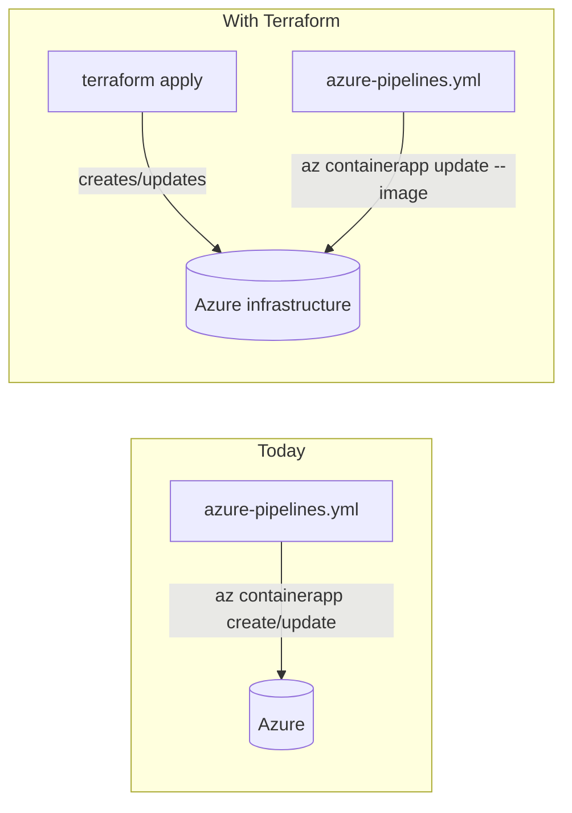
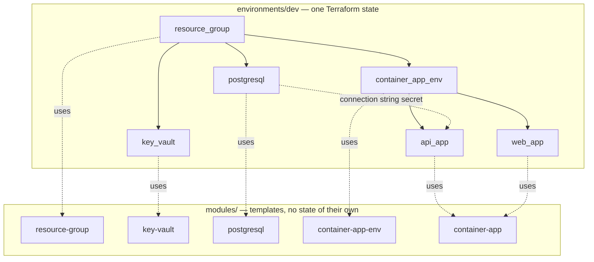
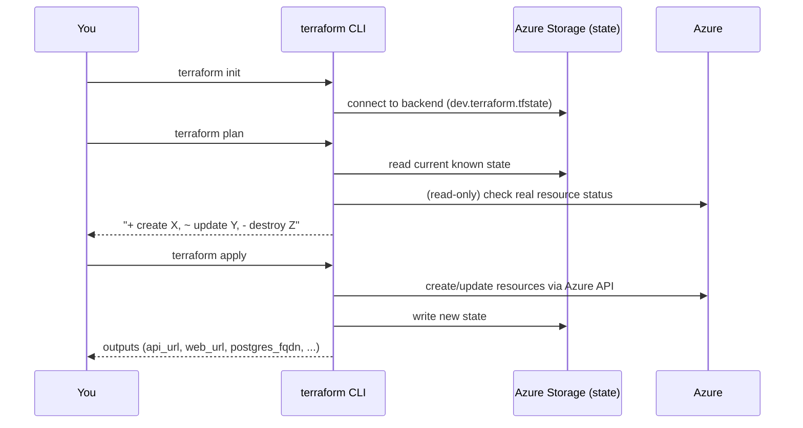

# Terraform Guide — ECommerceProject Infrastructure

This document explains **what** was added under [terraform/](.), **why** it's structured this way,
and **how** the whole thing actually runs end-to-end — so you can read it once and understand the
full flow without having to reverse-engineer the `.tf` files.

---

## 1. The big picture

Today, your infrastructure is created **imperatively** by [azure-pipelines.yml](../azure-pipelines.yml)
using `az containerapp create/update` shell commands during every pipeline run. That works, but it
has downsides:

- No single source of truth for "what infrastructure should exist" — it's implicit in a script.
- No `terraform plan` — you can't preview what a change will do before it happens.
- No easy way to see drift (someone changes a setting in the Azure Portal, nothing notices).
- Resources like the Resource Group, Key Vault, or PostgreSQL server are assumed to already exist
  (the pipeline never creates them).

Terraform replaces the **"create/configure infrastructure"** part with declarative code. The
**application deployment** part (build image → push → point the Container App at the new image
tag) can stay in the pipeline, or be folded into Terraform later — see [§8](#8-how-this-relates-to-azure-pipelinesyml-today).



---

## 2. Folder structure

```
terraform/
├── modules/                    # Reusable, environment-agnostic building blocks
│   ├── resource-group/         # azurerm_resource_group
│   ├── key-vault/               # azurerm_key_vault (RBAC-based)
│   ├── postgresql/              # azurerm_postgresql_flexible_server + database + firewall rules
│   ├── container-app-env/      # Log Analytics workspace + azurerm_container_app_environment
│   └── container-app/          # azurerm_container_app (used once for "api", once for "web")
├── environments/
│   ├── dev/                    # Deployable stack for Development
│   ├── staging/                # Deployable stack for Staging
│   └── prod/                   # Deployable stack for Production
├── global/                     # Reference-only files (see §6)
└── .gitignore                  # Keeps state/secrets out of git
```

**Key idea:** a *module* is not deployable by itself — it's a template. An *environment* folder is
what you actually `terraform apply`. Each environment:

1. Declares the Azure provider + required Terraform version.
2. Calls each module with environment-specific values (names, sizes, replica counts).
3. Has its own **state file** (its own memory of what it created) — dev, staging and prod are
   completely isolated from each other. Destroying dev cannot touch staging/prod.



Staging and prod folders are structurally identical to dev — same modules, different
`terraform.tfvars` (bigger CPU/memory/replica counts for prod, different names).

---

## 3. What each module creates

| Module | Azure resource(s) | Notes |
|---|---|---|
| `resource-group` | `azurerm_resource_group` | Just a container for everything else in that environment. |
| `key-vault` | `azurerm_key_vault` (+ role assignment) | RBAC-authorized (no legacy access policies). Grants the identity running `terraform apply` "Key Vault Secrets Officer". Not yet wired to the container apps at runtime (see [§9](#9-suggested-next-steps)). |
| `postgresql` | `azurerm_postgresql_flexible_server`, `..._database`, `..._firewall_rule` | Creates the server, the app database on it, and a firewall rule allowing Azure services through. |
| `container-app-env` | `azurerm_log_analytics_workspace`, `azurerm_container_app_environment` | The shared "environment" that Container Apps live inside (like an App Service Plan). |
| `container-app` | `azurerm_container_app` | Generic — instantiated **twice** per environment (once as `api_app`, once as `web_app`) with different images/ports/scaling. |

---

## 4. The full command flow

### One-time setup (per environment, done once by a human)
Terraform's remote state needs somewhere to live *before* `terraform init` can use it. This is the
one manual, imperative step:

```powershell
az group create -n ecommerce-tfstate-rg -l eastus
az storage account create -n ecommercetfstatedev -g ecommerce-tfstate-rg -l eastus --sku Standard_LRS
az storage container create -n tfstate --account-name ecommercetfstatedev
```
(Repeat with `ecommercetfstatestg` / `ecommercetfstateprod` for the other environments — see each
environment's `backend.tf`.)

### Every time you want to change dev infrastructure

```powershell
cd terraform/environments/dev

# Secrets are never in terraform.tfvars — export them for this shell session only:
$env:TF_VAR_postgres_admin_password = "<pick-a-strong-password>"
$env:TF_VAR_jwt_key                  = "<same-JWT-signing-key-the-API-expects>"

terraform init      # downloads azurerm provider + wires up the backend storage account
terraform plan      # shows exactly what will be created/changed/destroyed — READ THIS
terraform apply     # asks for confirmation, then creates everything in Azure
```



After `apply` finishes, `terraform output` prints the API/Web URLs and Postgres FQDN — no need to
run `az containerapp show` manually like the pipeline does today.

### Tearing an environment down
```powershell
terraform destroy
```
Only ever touches that one environment's resources (its own state file) — dev/staging/prod can't
accidentally destroy each other.

---

## 5. Where secrets go (and don't go)

| Value | Where it lives | Why |
|---|---|---|
| `postgres_admin_password`, `jwt_key` | `TF_VAR_...` environment variable (local) or a **secret pipeline variable** (CI) | Declared `sensitive = true`, **no default** in `variables.tf` — Terraform will error out until you supply it, so it can never silently leak into `terraform.tfvars`. |
| Resource names, SKU sizes, replica counts, image repo names | `terraform.tfvars` (committed) | Not secret — safe to version-control, and lets you see environment differences in a diff. |
| The generated Postgres connection string, JWT key at runtime | `azurerm_container_app` **secret** blocks (`postgres-connection`, `jwt-key`) | Container Apps' own secret store — the container reads them as env vars via `secretref:`, exactly like the pipeline's `az containerapp create --secrets ...` does today. |
| Terraform state (which can contain resolved secret values) | Azure Storage backend (`backend.tf`), never local disk, never git | `.gitignore` blocks `*.tfstate` everywhere as a safety net anyway. |

`terraform/.gitignore` also blocks `*.auto.tfvars` — if you want a local file Terraform picks up
automatically (instead of exporting env vars every session), name it e.g.
`secrets.auto.tfvars` and it will never be committed.

---

## 6. What `global/` actually is (read this — it's easy to misunderstand)

Terraform has **no built-in way** for one root module (an environment folder) to "import" or
"include" another root module's `provider`/`variable` blocks. `global/providers.tf` and
`global/variables.tf` are **not automatically used by anything** — they exist purely as a
documented reference/copy-paste source so dev/staging/prod don't drift from each other when you
e.g. bump the azurerm provider version. If you want genuine sharing with no copy/paste, that's
what [Terragrunt](https://terragrunt.gruntwork.io/) is for — it's a thin wrapper around Terraform
built specifically to solve this; it wasn't introduced here to keep things simpler.

---

## 7. How the API and Web URLs avoid a chicken-and-egg problem

The API's CORS setting needs the Web app's URL, and the Web app's `ApiBaseUrl` needs the API's URL.
If they referenced each other's Terraform resource output directly, you'd get a circular
dependency error. The fix (same trick the pipeline already uses via
`az containerapp env show --query properties.defaultDomain`): Container Apps FQDNs are
**predictable** — always `<app-name>.<environment-default-domain>` — so each environment's
`main.tf` computes both URLs from the *environment's* domain, not from each other:

```hcl
locals {
  api_fqdn = "${local.api_app_name}.${module.container_app_env.default_domain}"
  web_fqdn = "${local.web_app_name}.${module.container_app_env.default_domain}"
}
```
Both `api_app` and `web_app` modules only depend on `container_app_env`, never on each other.

---

## 8. How this relates to azure-pipelines.yml today

Right now there's a **naming mismatch you should know about**: `azure-pipelines.yml` uses one
shared `ecommerce-rg` / `ecommerce-env` for all three stages (dev/staging/prod share one resource
group and one Container Apps Environment — only the individual apps are named `-dev`/`-staging`/
`-prod`). This Terraform setup instead gives **each environment its own resource group and own
Container Apps Environment** (`ecommerce-rg-dev`, `ecommerce-env-dev`, etc.) — the more common
Terraform best practice (better isolation, a `terraform destroy` on dev can never affect prod).

That means, as-is, this Terraform code **will not manage your existing pipeline-created
resources** — it creates a parallel, isolated set of resources with different names. You have two
options going forward (no code change needed until you decide):

1. **Keep both, migrate deliberately**: run `terraform apply` for dev, point a copy of the
   pipeline's dev stage at the new `-dev`-suffixed resource group, verify it, then repeat for
   staging/prod, then delete the old shared `ecommerce-rg`.
2. **Match the current shared layout**: tell me and I can restructure so resource-group/Postgres/
   Container-Apps-Environment are created once (e.g. from a `platform`/`shared` root module) and
   dev/staging/prod only manage their two container apps inside it — closer to today's pipeline
   behavior, at the cost of losing full environment isolation.

Either way, once infrastructure exists via Terraform, `azure-pipelines.yml` can be simplified to
just build/push the image and run `az containerapp update --image ...` (or
`terraform apply -var image_tag=$(tag)`), dropping all the `az containerapp create` /
"does it exist yet" branching logic it currently has.

---

## 9. Suggested next steps (not yet done)

- Wire the Key Vault into the container apps at runtime (system-assigned managed identity +
  "Key Vault Secrets User" role + `KeyVault__VaultUri` app setting), instead of only using
  Container Apps' own `secret` blocks as today.
- Set up the pipeline to authenticate to Azure via OIDC/federated credentials for
  `terraform apply`, rather than only using `az cli` service connections.

**Registry decision: Docker Hub, not Azure Container Registry.** This project intentionally stays
on Docker Hub (`docker.io/rabiul1012/...`) — ACR has no free tier (cheapest "Basic" SKU is a
per-day cost even when idle), which doesn't fit a learning project. No `.tf` file creates an ACR
instance, and none should be added later purely to "look more Azure-native" — that would introduce
a real ongoing cost for no functional benefit here.

Both current images are **public** Docker Hub repos, so the `container-app` module doesn't set a
`registry` block at all (`registry_server` defaults to `""`) — Container Apps pulls anonymously,
same as `az containerapp create` does today with no `--registry-*` flags. If you ever switch either
repo to **private** (Docker Hub's free tier still allows a small number of private repos), no new
resource is needed — just pass through the module's already-built-in registry auth variables from
each environment's `main.tf`:

```hcl
module "api_app" {
  # ...
  registry_server   = "docker.io"
  registry_username = var.dockerhub_username
  registry_password = var.dockerhub_password # sensitive, via TF_VAR_dockerhub_password
}
```

---

## 10. Command cheat sheet

```powershell
terraform fmt -recursive        # auto-format all .tf files
terraform validate              # syntax/type-check (no Azure calls, no credentials needed)
terraform plan                  # preview changes (read-only against Azure)
terraform apply                 # make the changes
terraform output                # show this environment's outputs (URLs, FQDNs)
terraform state list            # see everything Terraform currently manages
terraform destroy               # tear this environment down
```

Run all of the above from inside `terraform/environments/<dev|staging|prod>/`.
